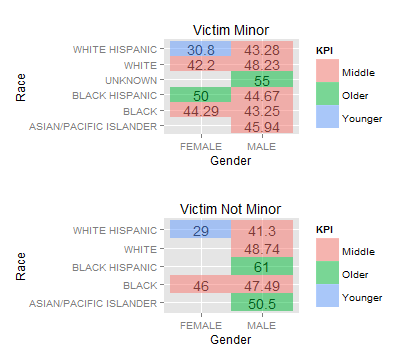
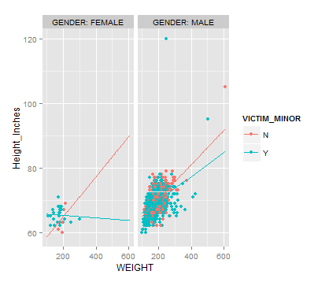
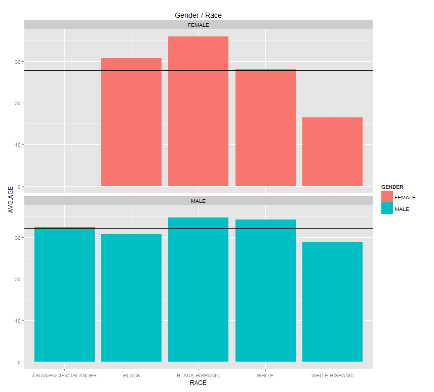

***Members***
```
Raymundo Cortez
Yuyin Wang
Chigozi Yejekwe
```

###R_ETL
```{r,eval=FALSE}
require(tidyr)
require(dplyr)
require(ggplot2)

file_path <- "Sex_Offenders.csv"
df <- read.csv(file_path, stringsAsFactors = FALSE)

# Replace "." (i.e., period) with "_" in the column names.
names(df) <- gsub("\\.+", "_", names(df))

#str(df) # Uncomment this and  run just the lines to here to get column types to use for getting the list of measures.

measures <- c("AGE","HEIGHT","WEIGHT")

# Get rid of special characters in each column.
# Google ASCII Table to understand the following:
for(n in names(df)) {
    df[n] <- data.frame(lapply(df[n], gsub, pattern="[^ -~]",replacement= ""))
}

dimensions <- setdiff(names(df), measures)
if( length(measures) > 1 || ! is.na(dimensions)) {
  for(d in dimensions) {
    # Get rid of " and ' in dimensions.
    df[d] <- data.frame(lapply(df[d], gsub, pattern="[\"']",replacement= ""))
    # Change & to and in dimensions.
    df[d] <- data.frame(lapply(df[d], gsub, pattern="&",replacement= " and "))
    # Change : to ; in dimensions.
    df[d] <- data.frame(lapply(df[d], gsub, pattern=":",replacement= ";"))
  }
}

# Get rid of all characters in measures except for numbers, the - sign, and period.dimensions
if( length(measures) > 1 || ! is.na(measures)) {
  for(m in measures) {
    df[m] <- data.frame(lapply(df[m], gsub, pattern="[^--.0-9]",replacement= ""))
  }
}

write.csv(df, paste(gsub(".csv", "", file_path), ".reformatted.csv", sep=""), row.names=FALSE, na = "")

tableName <- gsub(" +", "_", gsub("[^A-z, 0-9, ]", "", gsub(".csv", "", file_path)))
sql <- paste("CREATE TABLE", tableName, "(\n-- Change table_name to the table name you want.\n")
if( length(measures) > 1 || ! is.na(dimensions)) {
  for(d in dimensions) {
    sql <- paste(sql, paste(d, "varchar2(4000),\n"))
  }
}
if( length(measures) > 1 || ! is.na(measures)) {
  for(m in measures) {
    if(m != tail(measures, n=1)) sql <- paste(sql, paste(m, "number(38,4),\n"))
    else sql <- paste(sql, paste(m, "number(38,4)\n"))
  }
}
sql <- paste(sql, ");")
cat(sql)

####################################################################################

file_path <- "Sex_Offender_Summary.csv"
df <- read.csv(file_path, stringsAsFactors = FALSE)

# Replace "." (i.e., period) with "_" in the column names.
names(df) <- gsub("\\.+", "_", names(df))

#str(df) # Uncomment this and  run just the lines to here to get column types to use for getting the list of measures.

measures <- c("AVG_AGE","AVG_HEIGHT_IN","AVG_WEIGHT","COUNT_RACE")

# Get rid of special characters in each column.
# Google ASCII Table to understand the following:
for(n in names(df)) {
  df[n] <- data.frame(lapply(df[n], gsub, pattern="[^ -~]",replacement= ""))
}

dimensions <- setdiff(names(df), measures)
if( length(measures) > 1 || ! is.na(dimensions)) {
  for(d in dimensions) {
    # Get rid of " and ' in dimensions.
    df[d] <- data.frame(lapply(df[d], gsub, pattern="[\"']",replacement= ""))
    # Change & to and in dimensions.
    df[d] <- data.frame(lapply(df[d], gsub, pattern="&",replacement= " and "))
    # Change : to ; in dimensions.
    df[d] <- data.frame(lapply(df[d], gsub, pattern=":",replacement= ";"))
  }
}

# Get rid of all characters in measures except for numbers, the - sign, and period.dimensions
if( length(measures) > 1 || ! is.na(measures)) {
  for(m in measures) {
    df[m] <- data.frame(lapply(df[m], gsub, pattern="[^--.0-9]",replacement= ""))
  }
}

write.csv(df, paste(gsub(".csv", "", file_path), ".reformatted.csv", sep=""), row.names=FALSE, na = "")

tableName <- gsub(" +", "_", gsub("[^A-z, 0-9, ]", "", gsub(".csv", "", file_path)))
sql <- paste("CREATE TABLE", tableName, "(\n-- Change table_name to the table name you want.\n")
if( length(measures) > 1 || ! is.na(dimensions)) {
  for(d in dimensions) {
    sql <- paste(sql, paste(d, "varchar2(4000),\n"))
  }
}
if( length(measures) > 1 || ! is.na(measures)) {
  for(m in measures) {
    if(m != tail(measures, n=1)) sql <- paste(sql, paste(m, "number(38,4),\n"))
    else sql <- paste(sql, paste(m, "number(38,4)\n"))
  }
}
sql <- paste(sql, ");")
cat(sql)
```

###Summary
The dataset we used is a csv containing a list of sex offenders residing in the City of Chicago provided by the Chicago Police Department. Information for each person includes Name, Block of residence, Date of Birth, Race, Gender, Age, Weight, Height, and whether their victim was a minor or not. The dataset also included a row of redundant title names and a few "Unknown"s which were filtered out in the making of the tables below.

A second csv named Sex Offender Summary was created detailing Aerage age,average height in inches, average weight,number of entrants per race,percent male,and percent of victims that were minors, grouped by race. This csv was then blended with the original csv, which is shown in the tableau workbook.

###Graphs

***Graph 1***
```
The following cross-tab displays the average age of sex offenders as broken down by gender and race, separated by if their victims were minors. KPI is defined by age in two categories: older (above 50) and younger (below 30). From the table we can observe that:
-Most sex offenders are around 40-50 years old
-Black hispanics averages to be the oldest for both pedophiles and normal sex offenders
-White hispanics averages to be the youngest for both pedophiles and normal sex offenders
-Males are older than females for normal sex offenders
-Female pedophiles have a larger spread in age across ages than male pedophiles.
```


```{r,eval=FALSE}
require("dyplr")
require("ggplot2")
require("jsonlite")
require("RCurl")
require("plyr")
require("gridExtra")

ds <- data.frame(fromJSON(getURL(URLencode('skipper.cs.utexas.edu:5001/rest/native/?query="select * from SEX_OFFENDERS"'),httpheader=c(DB='jdbc:oracle:thin:@sayonara.microlab.cs.utexas.edu:1521:orcl', USER='C##cs329e_rc37495', PASS='orcl_rc37495', MODE='native_mode', MODEL='model', returnDimensions = 'False', returnFor = 'JSON'), verbose = TRUE), ))

ds$AGE <- as.numeric(as.character(ds$AGE))

######### Variable ###########
kpi_low_max = 35.00
kpi_med_max = 50.00
######### Variable ###########


# Make subset datasets - split by if victim is minor
yes_ds <- subset(ds, ds$VICTIM_MINOR=="Y")
yes_ds = ddply(yes_ds, .(GENDER,RACE), summarize, mean=mean(AGE))
yes_ds[,'mean']=round(yes_ds[,'mean'],2)

no_ds <- subset(ds, ds$VICTIM_MINOR=="N")
no_ds = ddply(no_ds, .(GENDER,RACE), summarize, mean=mean(AGE))
no_ds[,'mean']=round(no_ds[,'mean'],2)


# add column of low-med-hig ratings with respect to KPI measures
yes_ds = within(yes_ds, {
  KPI = ifelse(mean < kpi_low_max, "Younger", ifelse(mean < kpi_med_max, "Middle", "Older"))})
no_ds = within(no_ds, {
  KPI = ifelse(mean < kpi_low_max, "Younger", ifelse(mean < kpi_med_max, "Middle", "Older"))})


# make cross-tab for rapists with minor victims
yes_plot <- ggplot() + 
  coord_cartesian() + 
  scale_x_discrete() +
  scale_y_discrete() +
  labs(title='Victim Minor') +
  labs(x=("Gender"), y=("Race")) +
  layer(data=yes_ds, 
        mapping=aes(x=GENDER, y=RACE, label=mean),
        stat="identity", 
        stat_params=list(), 
        geom="text",
        geom_params=list(colour="black"), 
        position=position_identity()
  ) +
  layer(data=yes_ds, 
        mapping=aes(x=GENDER, y=RACE, fill=KPI), 
        stat="identity", 
        stat_params=list(), 
        geom="tile",
        geom_params=list(alpha=0.50), 
        position=position_identity()
  )

# make cross-tab for rapists without minor victims
no_plot <- ggplot() + 
  coord_cartesian() + 
  scale_x_discrete() +
  scale_y_discrete() +
  labs(title='Victim Not Minor') +
  labs(x=("Gender"), y=("Race")) +
  layer(data=no_ds, 
        mapping=aes(x=GENDER, y=RACE, label=mean),
        stat="identity", 
        stat_params=list(), 
        geom="text",
        geom_params=list(colour="black"),
        position=position_identity()
  ) +
  layer(data=no_ds, 
        mapping=aes(x=GENDER, y=RACE, fill=KPI), 
        stat="identity", 
        stat_params=list(), 
        geom="tile",
        geom_params=list(alpha=0.50), 
        position=position_identity()
  )

# plot both graphs
grid.arrange(yes_plot, no_plot)

```


***Graph 2***
```
This graph shows the spread of height/weight ratios for sex offenders, broken down by sex, colour coded by if their victim was a minor. Trend lines were added to make any possible trends within the bulk of points more visible. We can observe that:
-Female sex offenders appear to be around 60-70 inches tall, 100-300 pounds
-Male sex offenders appear to be around 60-80 inches tall, 100-350 pounds
-Sex offenders, both male and female, pedophile or otherwise, have a wide range of body sizes. There is a weak -positive trend of weight and height, but there is a large variance of height as weight increases.
-There are significantly more male sex offenders reported than females. Due to the small sample size, we will not be analysing the female side of the graph.
-Pedophiles heights seem to increase at a slower rate than weight as compared to normal sex offenders for males, but the difference between the two trend lines, as compared to the fairly small sample size (about 1300 sex offenders) is not great enough that we confidently say this is a supported conclusion to draw.
```


```{r,eval=FALSE}
require(jsonlite)
require(RCurl)
require(dplyr)
require(ggplot2)
df <- data.frame(fromJSON(getURL(URLencode('skipper.cs.utexas.edu:5001/rest/native/?query="select * from SEX_OFFENDERS"'),httpheader=c(DB='jdbc:oracle:thin:@sayonara.microlab.cs.utexas.edu:1521:orcl', USER='C##cs329e_rc37495', PASS='orcl_rc37495', MODE='native_mode', MODEL='model', returnDimensions = 'False', returnFor = 'JSON'), verbose = TRUE), ))

df$HEIGHT <- as.numeric(as.character(df$HEIGHT))
df$WEIGHT <- as.numeric(as.character(df$WEIGHT))

ndf <- df %>% filter(HEIGHT != "null")
ndf$Height_Inches <- 60 + (ndf$HEIGHT %% 100)
ndf$Height_Inches[ndf$HEIGHT > 550] <- 72 + (ndf$HEIGHT[ndf$HEIGHT > 550] %% 100)

ndf <- ndf %>% select(GENDER,WEIGHT,Height_Inches,VICTIM_MINOR)

ggplot() + 
  coord_cartesian() + 
  scale_x_continuous() +
  scale_y_continuous() +
  facet_grid(.~GENDER, labeller=label_both) +
  layer(data=ndf, 
        mapping=aes(x=WEIGHT, y=Height_Inches, color=VICTIM_MINOR), 
        stat="identity", 
        stat_params=list(), 
        geom="point",
        geom_params=list(), 
        position=position_identity()
  ) +
  stat_smooth(data=ndf,
              mapping = aes(x=WEIGHT, y=Height_Inches, color=VICTIM_MINOR),
              method = "lm",
              fullrange = TRUE,
              se = FALSE
              )

```


***Graph 3***
```
The Bar Graph displays average age by race. It is further separated into two bar graphs, one for females and one for males (They are also colored differently to make the distinction more obvious). Reference lines were added for the overall average age in women and men, to compare against the specific races' averages. From the Graph we can see that:
-The average male sex offender is around 5 years older than the average female sex offender
-That Black Hispanic sex offenders seem to be older in both male and female categories
-White hispanic sex offenders tend to be younger in both categories
-White hispanic female sex offenders seem to be younger than white hispanic male sex offenders in average
```


```{r,eval=FALSE}
##Attempting to recreate the Tableau bar graph into R. 
##First I needed to edit the data so I grouped the data by the Gender and Race columns, and filtered out the nondescriptive data such as "Unknown" race. 
##In addition, summarize was used to create an AVG_AGE column using the mean() function.
df$AGE <- as.numeric(as.character(df$AGE))
dftwo <- df %>% group_by(GENDER, RACE, add = FALSE) %>% filter(RACE %in% c("BLACK", "BLACK HISPANIC", "WHITE", "WHITE HISPANIC", "ASIAN/PACIFIC ISLANDER")) %>% summarize(AVG_AGE = mean(AGE)) 


##Observing the spread of the data to ensure that the nondescriptive data was removed.
spread(dftwo, GENDER, AVG_AGE) %>% AGE 

##Viewing the data again to double check the columns and rows.
dftwo

##Creation of a test ggplot graph to ensure that the data was editted properly and graphs could be reproduced. 
dftwo %>% ggplot(aes(x = RACE, y = AVG_AGE)) + geom_bar(stat = "identity") 

##First graph created. Faceting the graphy by Gender. Created labels for the Title, X-axis, and Y-axis. 
ggplot() + 
  coord_cartesian() +
  scale_x_discrete() + 
  scale_y_continuous() +
  facet_wrap(~GENDER, ncol = 1) +
  labs(title = 'Gender / Race') +
  labs(x = paste("RACE"), y = paste("AVG.AGE")) +
  layer(data = dftwo,
        mapping = aes(x = RACE, y = AVG_AGE),
        stat = "identity",
        stat_params = list(), 
        geom = "bar",
        geom_params = list(color = "blue"),
        position=position_identity()   )

##Recreation of the previous graph in order to correct the coloring of the graph so that it more closely matches the Tableau graph.
ggplot() + 
  coord_cartesian() +
  scale_x_discrete() + 
  scale_y_continuous() +
  facet_wrap(~GENDER, ncol = 1) +
  labs(title = 'Gender / Race') +
  labs(x = paste("RACE"), y = paste("AVG.AGE")) +
  layer(data = dftwo,
        mapping = aes(x = RACE, y = AVG_AGE, fill = GENDER),
        stat = "identity",
        stat_params = list(), 
        geom = "bar"
  ) 

##In order to create a reference line, I needed to further edit the data. I created a new dataframe, dfthree that ungrouped and then re-grouped the data just by gender in order to get an average age per gender.    
dfthree <- dftwo %>% ungroup %>% group_by(GENDER) %>% summarize(WINDOW_AVG_AGE = mean(AVG_AGE)) 

##Merged the average age per gender data frame that was previously created with the original data frame using inner_join
dffour <- inner_join(dftwo, dfthree, by = "GENDER")

##Final graph with proper coloing and reference line added for each respective gender facet.
##Reference line added by setting the yintercept equal to the average age per gender.
ggplot() + 
  coord_cartesian() +
  scale_x_discrete() + 
  scale_y_continuous() +
  facet_wrap(~GENDER, ncol = 1) +
  labs(title = 'Gender / Race') +
  labs(x = paste("RACE"), y = paste("AVG.AGE")) +
  layer(data = dffour,
        mapping = aes(x = RACE, y = AVG_AGE, fill = GENDER),
        stat = "identity",
        stat_params = list(), 
        geom = "bar"
  ) +
  layer(data = dffour, 
        mapping = aes(yintercept = WINDOW_AVG_AGE), 
        geom= "hline",
        geom_params = list(color = "black")
  )
```

