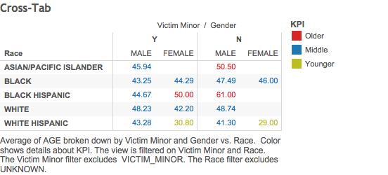
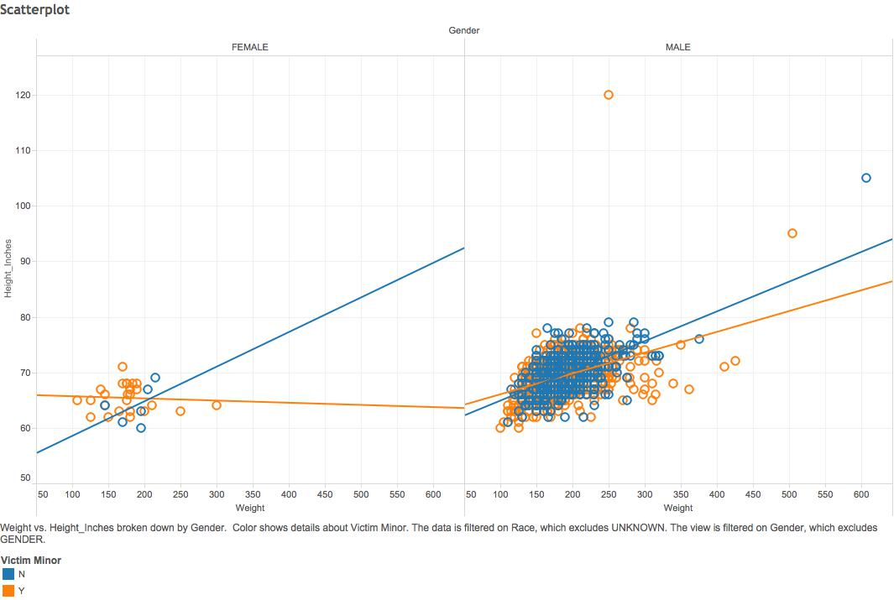
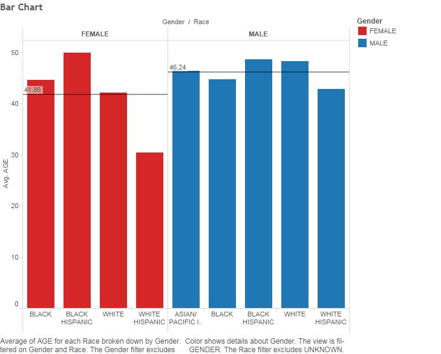

***Members***
```
Raymundo Cortez
Yuyin Wang
Chigozi Yejekwe
```

###R_ETL
```{r,eval=FALSE}
require(tidyr)
require(dplyr)
require(ggplot2)

file_path <- "Sex_Offenders.csv"
df <- read.csv(file_path, stringsAsFactors = FALSE)

# Replace "." (i.e., period) with "_" in the column names.
names(df) <- gsub("\\.+", "_", names(df))

#str(df) # Uncomment this and  run just the lines to here to get column types to use for getting the list of measures.

measures <- c("AGE","HEIGHT","WEIGHT")

# Get rid of special characters in each column.
# Google ASCII Table to understand the following:
for(n in names(df)) {
    df[n] <- data.frame(lapply(df[n], gsub, pattern="[^ -~]",replacement= ""))
}

dimensions <- setdiff(names(df), measures)
if( length(measures) > 1 || ! is.na(dimensions)) {
  for(d in dimensions) {
    # Get rid of " and ' in dimensions.
    df[d] <- data.frame(lapply(df[d], gsub, pattern="[\"']",replacement= ""))
    # Change & to and in dimensions.
    df[d] <- data.frame(lapply(df[d], gsub, pattern="&",replacement= " and "))
    # Change : to ; in dimensions.
    df[d] <- data.frame(lapply(df[d], gsub, pattern=":",replacement= ";"))
  }
}

# Get rid of all characters in measures except for numbers, the - sign, and period.dimensions
if( length(measures) > 1 || ! is.na(measures)) {
  for(m in measures) {
    df[m] <- data.frame(lapply(df[m], gsub, pattern="[^--.0-9]",replacement= ""))
  }
}

write.csv(df, paste(gsub(".csv", "", file_path), ".reformatted.csv", sep=""), row.names=FALSE, na = "")

tableName <- gsub(" +", "_", gsub("[^A-z, 0-9, ]", "", gsub(".csv", "", file_path)))
sql <- paste("CREATE TABLE", tableName, "(\n-- Change table_name to the table name you want.\n")
if( length(measures) > 1 || ! is.na(dimensions)) {
  for(d in dimensions) {
    sql <- paste(sql, paste(d, "varchar2(4000),\n"))
  }
}
if( length(measures) > 1 || ! is.na(measures)) {
  for(m in measures) {
    if(m != tail(measures, n=1)) sql <- paste(sql, paste(m, "number(38,4),\n"))
    else sql <- paste(sql, paste(m, "number(38,4)\n"))
  }
}
sql <- paste(sql, ");")
cat(sql)
```

###Summary
The dataset we used is a csv containing a list of sex offenders residing in the City of Chicago provided by the Chicago Police Department. Information for each person includes Name, Block of residence, Date of Birth, Race, Gender, Age, Weight, Height, and whether their victim was a minor or not. The dataset also included a row of redundant title names and a few "Unknown"s which were filtered out in the making of the tables below.

###Graphs

***Graph 1***
```
The following cross-tab displays the average of each gender/race's ages, separated by if their victims were minors. KPI is defined by age in two categories: older (above 50) and younger (below 30). From the table we can observe that most sex offenders appear to be in the "middle" range. There doesn't appear to be a significant difference between the age ranges that assaulted minors and those who assaulted non-minors. When comparing between the genders, the average age doesn't seem to skew in one way more than the other. That is, there are an almost even amount of categories where the average woman age was higher than the male and vice-versa. So it appears there is not much evidence to support that one gender of sex offender tends to be older than the other.
```


***Graph 2***
```
The Scatterplot displays Height and Weight, separated by Gender. The plot points are also colored by whether or not the victim was a minor. Trend lines were added to make any possible trends within the bulk of points more visible. It is clear from the plot points that there are significantly more male sex offenders than female. Though possibly not a solid conclusion, the trend lines show that sex offenders who assaulted minors tend to weigh more and be shorter than those who assaulted non-minors. This trend is present in both the male and female categories.
```


***Graph 3***
```
The Bar Graph displays average age by race. It is further separated into two bar graphs, one for females and one for males (They are also colored differently to make the distinction more obvious). Reference lines were added for the overall average age in women and men, to compare against the specific races' averages. From the Graph we can see that the average male sex offender is around 5 years older than the average female sex offender. We can also see that Black Hispanic sex offender seem to be older in both male and female categories and that White hispanic tend to be younger in both.
```


